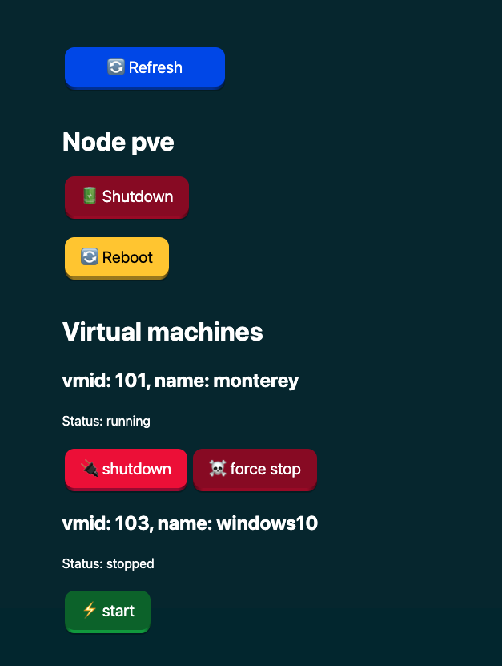

# Proxmox Remote control
Turn VMs on/off. Proxmox simplified remote control for VMs. Expose proxmox VE api using reverse proxy(using nginx), and expose a remote control like page.

## Example


## Configuration
Before installation, you need to generate an API token and fill it inside the `index.js` file. Also fill in the correct proxmox api base url(the one that will be exposed by the Nginx configuration).


## Installation

1. Install nginx
```bash
apt-get install nginx
``` 

2. Copy nginx file from `repository/nginx/default` to `/etc/nginx/sites-available/default`

3. Create proxmox-remote-control public folder, and put the files from this project inside it:
```bash
mkdir /media/proxmox-remote-control

# add "index.html, index.css, index.js" inside the folder
```
4. Reload nginx
```bash
systemctl reload nginx
```